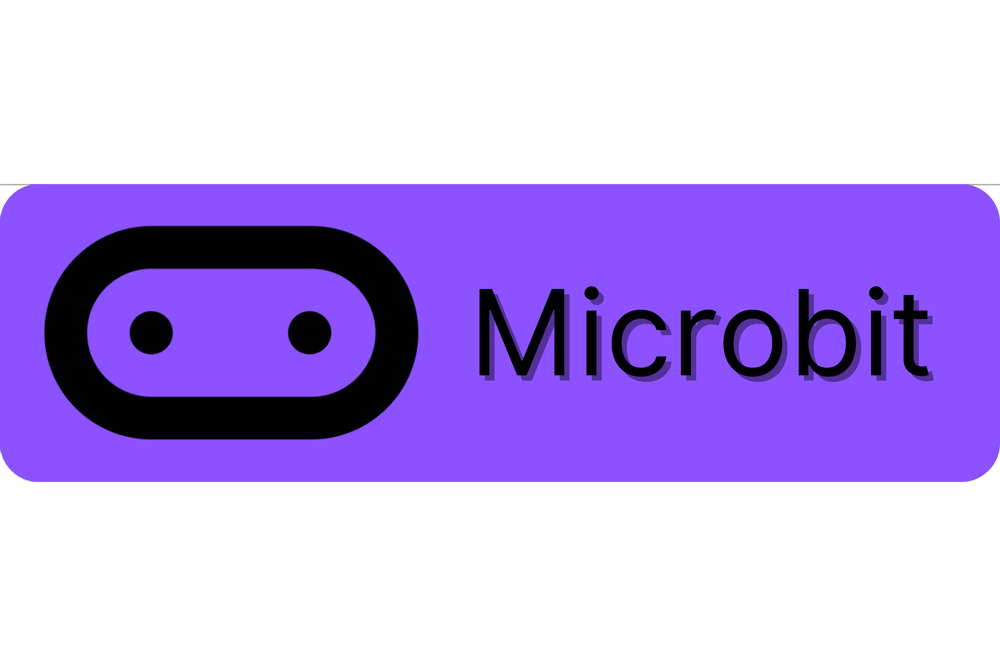

<h1>Hi there 👋</h1>

My name is Peter Zerbinos and I'm a student at <a href="http://mths.ca">St. Mother Teresa HS</a>, Ottawa, Canada.

<h2>🕸️ Course Websites</h2>

  <a href="https://sites.google.com/ocsb.ca/teh-icd2or">ICD2O</a>
  <a href="https://sites.google.com/ocsb.ca/teh-tej2or">TEJ2O</a>

<h2>✍ Programming Languages</h2>

  
  
  
  
  
  
  

<h2>💻 Operating Systems</h2>

  
  
  
  

## 🔧 Tools

  

  
  
  
  

## 🏅 Awards & Affiliations

<!--
**peter-zerbinos/peter-zerbinos** is a ✨ _special_ ✨ repository because its `README.md` (this file) appears on your GitHub profile.

Here are some ideas to get you started:

- 🔭 I’m currently working on ...
- 🌱 I’m currently learning ...
- 👯 I’m looking to collaborate on ...
- 🤔 I’m looking for help with ...
- 💬 Ask me about ...
- 📫 How to reach me: ...
- 😄 Pronouns: ...
- ⚡ Fun fact: ...
-->